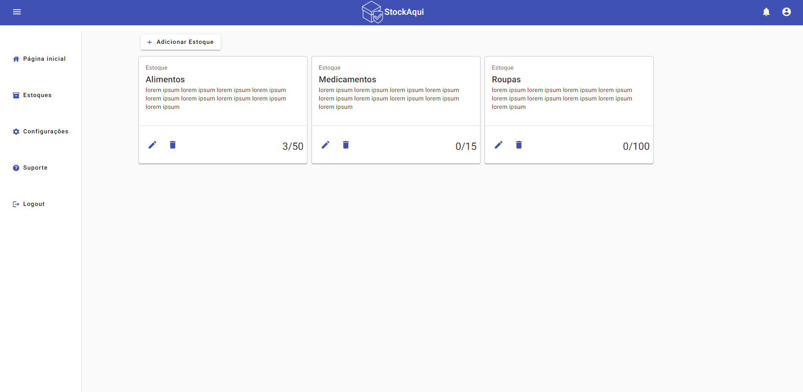
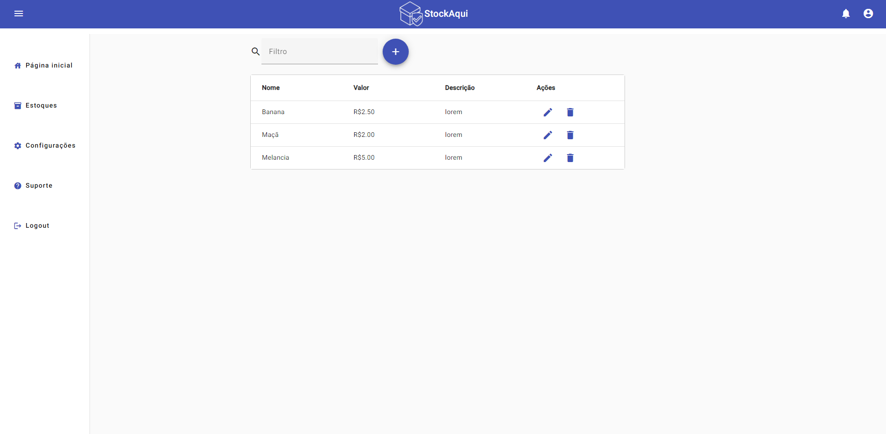

# projeto-pweb-i
 Projeto realizado na disciplina de Programação Web I, utilizando o framework Angular no front-end e Java com Spring Boot no back-end

 Integrantes: Gabriel Macaúbas Melo e Louise Fernandes Caetano.
 

